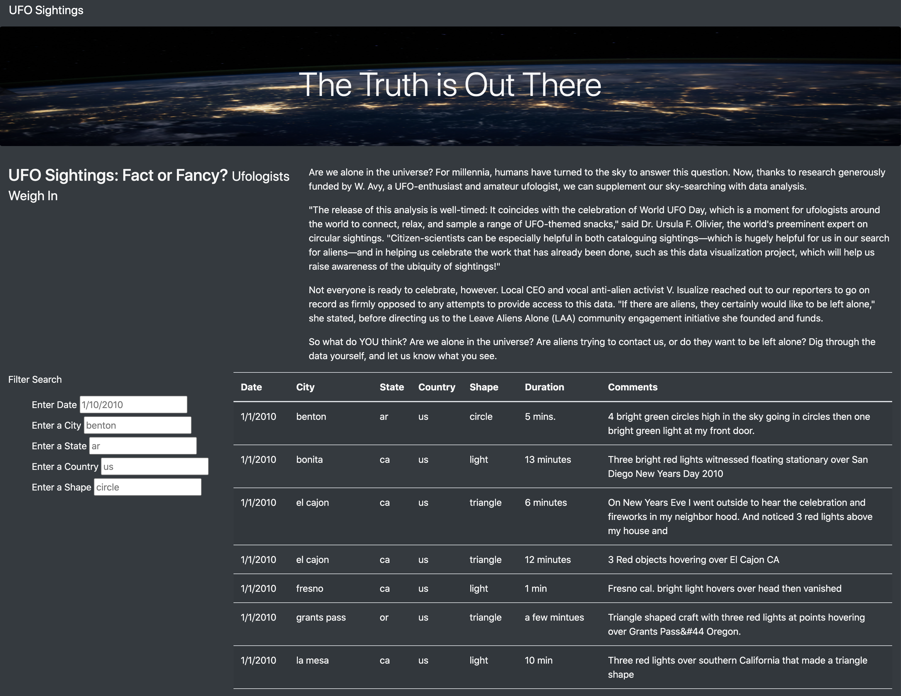
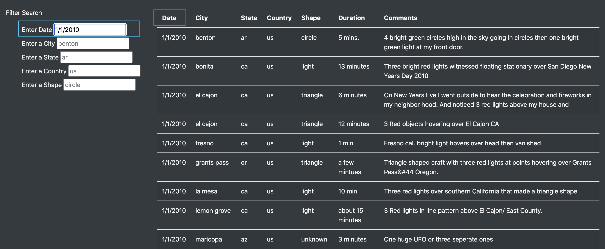
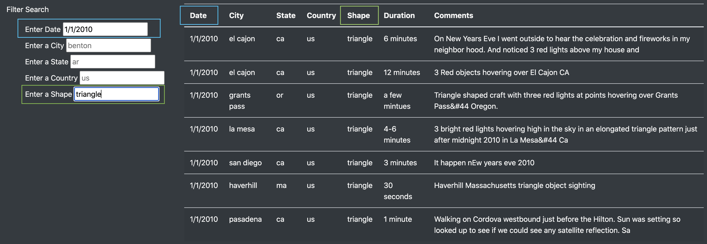
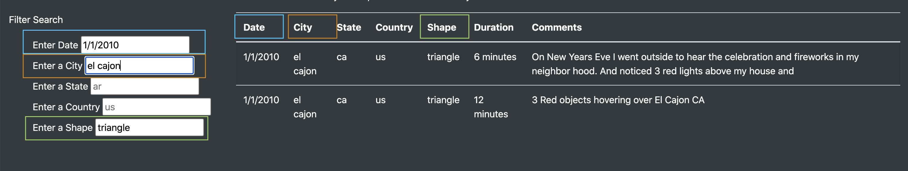

# UFOs
## Project Overview

In this project, the goal was to pull UFO data from a variety of sources and display it on an interactive webpage. One part of the webpage contains a summary about UFOs and the second part contains a user friendly table that stores UFO data. In order to create a user fiendly table, we added filters on multiple criteria such as Date of sighting, City, State, Country, and Shape of UFO.
### Tools
- The table was created using JavaScript
- HTML/CSS and Bootstrap were used to modify the appearance of the webpage.

## Results

When first arriving on the webpage, this is what the user sees:

As you can see in the above image, there are a variety of dates for a UFO sighting, cities, states, countries where a UFO was sighted and the shape of the spotted UFOs. Below we will go through an example of how a user may fitler the table to focus on certain data points.

1. Filter by date - in our case the user typed the date 1/1/2010 and clicked enter:

2. Filter by shape - in our case the user filtered by triangle:

3. Filter by city - in our case the user filtered by El Cajon:

## Summary
drawback and 2 recommentations